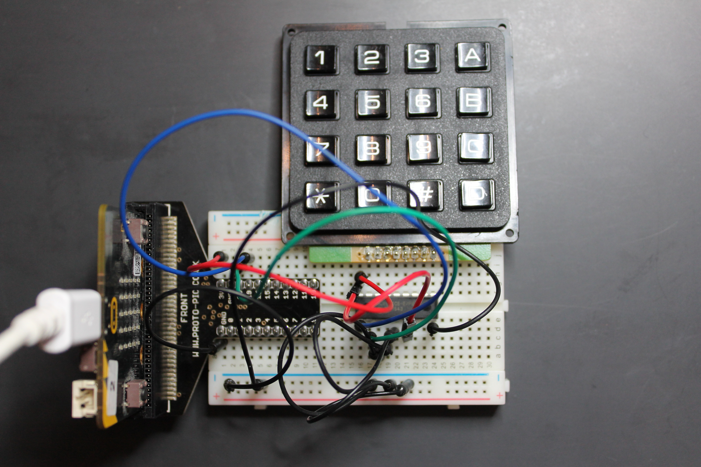

# micro:bit libraries

## micro:bit scan

A useful utility that scans the I2C bus and reports the IDs of the devices it sees.

## An I2C keypad reader using the MCP23008

This simple example reads and prints key-presses on a 16-key hex keypad using an MCP23008 I"C port extender

The code is at `src/babelboard/microbit/mcp23008.py`

## An SPI keypad reader using the MCP23S08

Sumilar to the example above, this code uses SPI to drive a MCP23S08 port expander.

